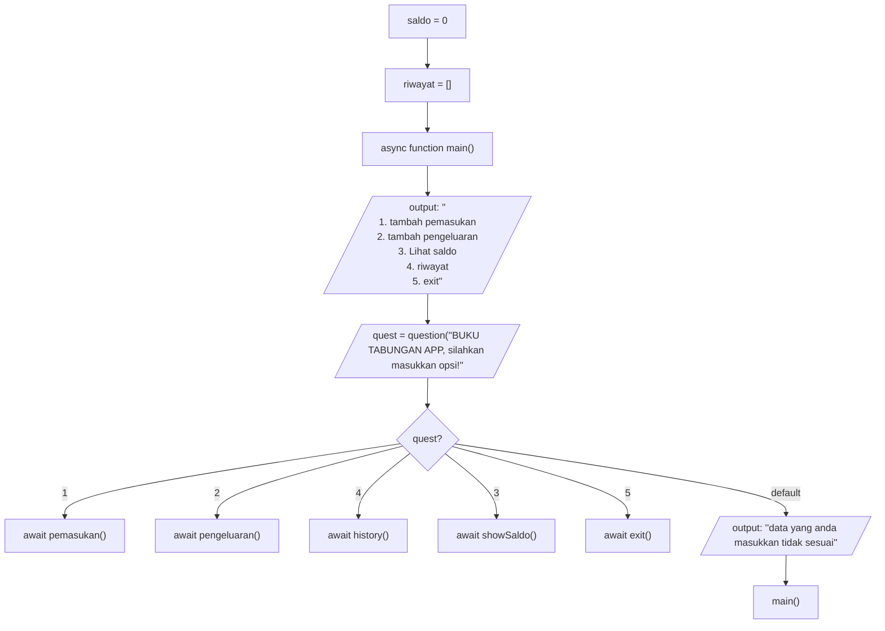
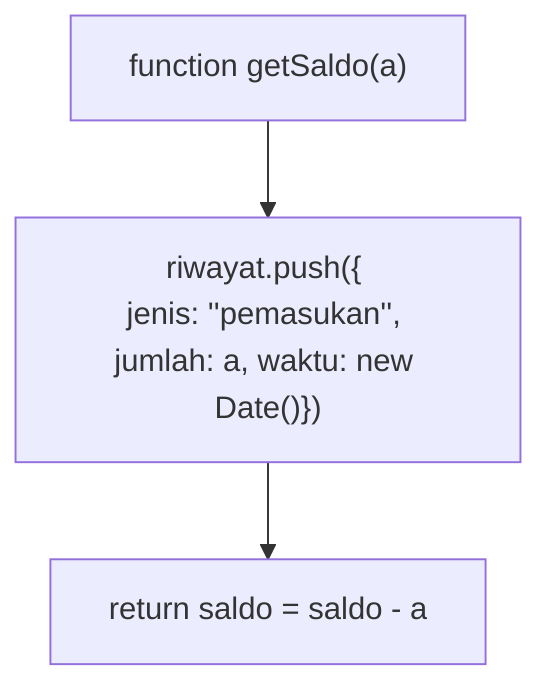

# flowchart main()

```mermaid
flowchart TD
saldo@{shape: rect, label: "saldo = 0"}
riwayat@{shape: rect, label: "riwayat = []"}
async@{shape: rect, label: "async function main()"}
output@{shape: lean-r, label: "output: ''
1. tambah pemasukan
2. tambah pengeluaran
3. Lihat saldo
4. riwayat
5. exit''"}
quest@{shape: lean-r, label: "quest = question(''BUKU TABUNGAN APP, silahkan masukkan opsi!''"}
quest?@{shape: diamond, label: "quest?"}
pemasukan@{shape: rect, label: "await pemasukan()"}
pengeluaran@{shape: rect, label: "await pengeluaran()"}
riwayatt@{shape: rect, label: "await history()"}
saldoo@{shape: rect, label: "await showSaldo()"}
exit@{shape: rect, label: "await exit()"}
default@{shape: lean-r, label: "output: ''data yang anda masukkan tidak sesuai''"}
main@{shape: rect, label: "main()"}


saldo --> riwayat
riwayat --> async
async --> output
output --> quest
quest --> quest?
quest? --1--> pemasukan
quest? --2--> pengeluaran
quest? --4--> riwayatt
quest? --3--> saldoo
quest? --5--> exit
quest? --default--> default
default --> main
```
---
# getSaldo()

```mermaid
flowchart TD
gs@{shape: rect, label: "function getSaldo(a)"}
riwayatP@{shape: rect, label: "riwayat.push({ 
    jenis: ''pemasukan'', jumlah: a, waktu: new Date()})"}
return@{shape: rect, label: "return saldo = saldo + a"}


gs --> riwayatP
riwayatP --> return
```
---
# getSaldoMin()

```mermaid
flowchart TD
gs@{shape: rect, label: "function getSaldo(a)"}
riwayatP@{shape: rect, label: "riwayat.push({ 
    jenis: ''pemasukan'', jumlah: a, waktu: new Date()})"}
return@{shape: rect, label: "return saldo = saldo - a"}


gs --> riwayatP
riwayatP --> return
```