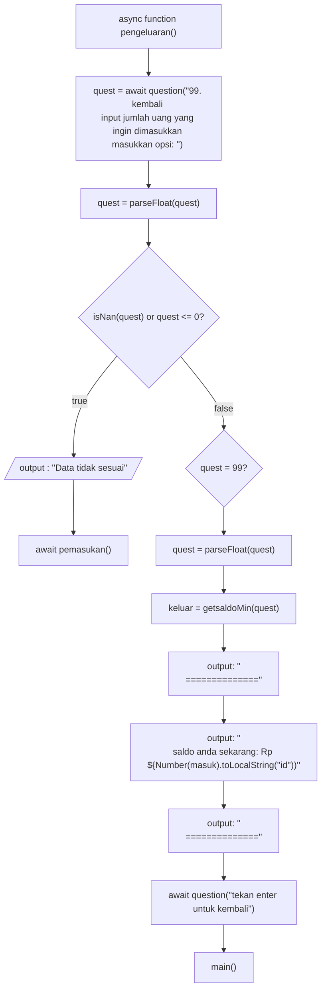

# flowchart fitur pengeluaran

```mermaid
flowchart TD
start@{shape: rect, label: "async function pengeluaran()"}
quest@{shape: rect, label: "quest = await question(''99. kembali \ninput jumlah uang yang ingin dimasukkan \n masukkan opsi: '') "}

pi@{shape: rect, label: "quest = parseFloat(quest)"}
isNan@{shape: diamond, label: "isNan(quest) or quest <= 0?"}
tdkSesuai@{shape: lean-r, label: "output : ''Data tidak sesuai''"}
await@{shape: rect, label: "await pemasukan()"}
q99@{shape: diamond, label: "quest = 99?"}
pf@{shape: rect, label: "quest = parseFloat(quest)"}
keluar@{shape: rect, label: "keluar = getsaldoMin(quest)"}
output1@{shape: rect, label: "output: ''
==============''"}
output2@{shape: rect, label: "output: ''
saldo anda sekarang: Rp ${Number(masuk).toLocalString(''id''))''"}
output3@{shape: rect, label: "output: ''
==============''"}
question@{shape: rect, label: "await question(''tekan enter untuk kembali'')"}
main@{shape: rect, label: "main()"}


start --> quest
quest --> pi
pi --> isNan
isNan --true--> tdkSesuai
tdkSesuai --> await
isNan --false--> q99
q99 --> pf
pf --> keluar
keluar --> output1
output1 --> output2
output2 --> output3
output3 --> question
question --> main


```