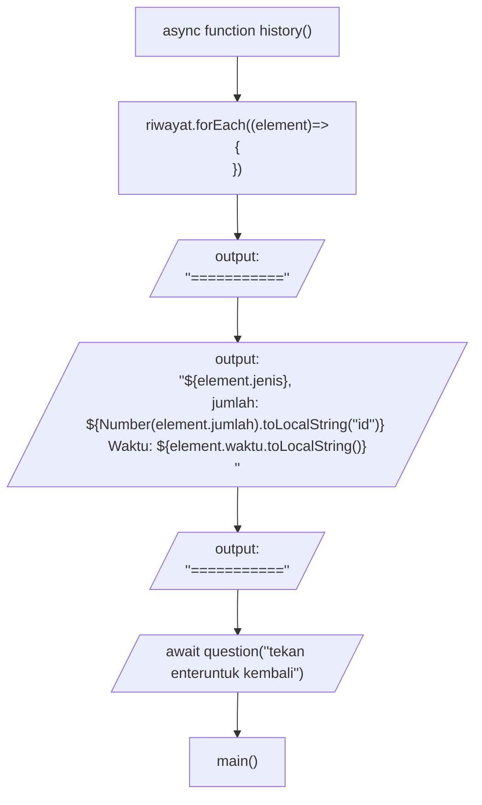

# flowchart riwayat

```mermaid
flowchart TD
async@{shape: rect, label: "async function history()"}
fe@{shape: rect, label: "riwayat.forEach((element)=>{
})"}
output@{shape: lean-r, label: "output:
''===========''"}
output2@{shape: lean-r, label: "output:
''${element.jenis}, \njumlah: ${Number(element.jumlah).toLocalString(''id'')} \nWaktu: ${element.waktu.toLocalString()}\n ''"}
output3@{shape: lean-r, label: "output:
''===========''"}
await@{shape: lean-r, label: "await question(''tekan enteruntuk kembali'')"}
main@{shape: rect, label: "main()"}


async --> fe
fe --> output
output --> output2
output2 --> output3
output3 --> await
await --> main

```