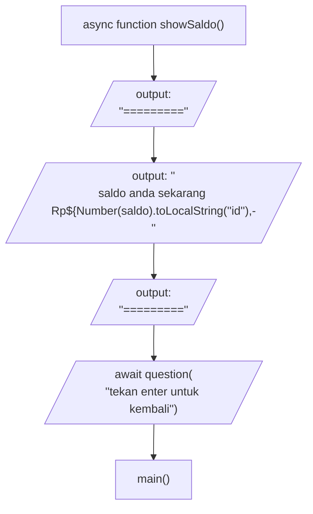

# flowchart showSaldo

```mermaid
flowchart TD
async@{shape: rect, label: "async function showSaldo()"}
output1@{shape: lean-r, label: "output:
''=========''"}
output2@{shape: lean-r, label: "output: ''
saldo anda sekarang Rp${Number(saldo).toLocalString(''id''),-''"}
output3@{shape: lean-r, label: "output:
''=========''"}
await@{shape: lean-r, label: "await question(
''tekan enter untuk kembali'')"}
main@{shape: rect, label: "main()"}

async --> output1
output1 --> output2
output2 --> output3
output3 --> await
await --> main

```